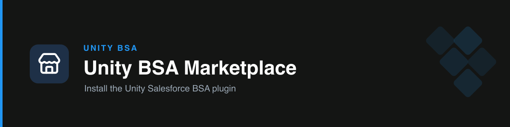

# Unity BSA Marketplace

A Claude Code plugin marketplace hosting **`unity-bsa`** — the Unity Business Systems team's Salesforce delivery toolkit. One install gives your team a set of focused skills that turn the BSA workflow (flows, technical design, mockups, comms, decks, QA, project planning) into repeatable, standards-enforcing actions.

## What's inside

| Plugin | Description |
| --- | --- |
| [`unity-bsa`](./plugins/unity-bsa) | Salesforce BSA toolkit — 8 skills covering the full delivery lifecycle, each enforcing Unity's real standards. |

## Install

This marketplace is a git repository. How you consume it depends on where your team runs Claude:

### Claude app / Cowork (upload)
The team runs in the Claude desktop/web app. Install the plugin file directly:
1. **Customize → Skills → Create plugin → Upload plugin**
2. Select `plugins/unity-bsa` packaged as a `.plugin` file (see the plugin README).

### Claude Code CLI or Cowork "Add marketplace"
```
/plugin marketplace add Yakov-Asael/unity-bsa-plugin
/plugin install unity-bsa
```
> **Note:** the marketplace path requires the repo to be **readable** by the client. While this repo is **private**, anonymous fetches fail — use the upload method above, or make the repo accessible.

## Updating

- **Marketplace:** re-sync the marketplace and reinstall.
- **Upload:** uninstall and re-upload the latest `.plugin`.
- **Team-wide, managed:** publish via **Organization plugins** (your Cowork org admin) for centrally-maintained updates.

## Author

Unity Business Systems team.
