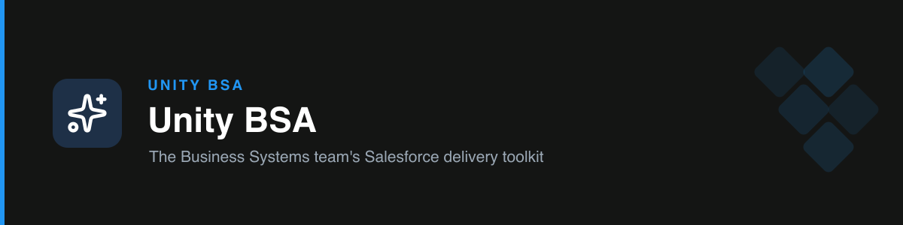

# unity-bsa

The Unity Business Systems team's **Salesforce delivery toolkit**. It packages each "power" of a senior BSA as a focused skill — so Claude reviews your Flows to the team bar, writes PRDs/TDDs and user stories, produces SLDS 2 mockups and Unity-branded emails, drafts stakeholder comms, builds on-brand decks, analyzes failures, plans QA, and steers projects through your delivery phases. Every skill enforces Unity's **real** standards, not generic advice.

## How it works

- **Focused skills, not one mega-prompt.** Each capability is its own skill with a narrow trigger, so Claude picks the right one instead of guessing.
- **`unity-sf-bsa` is the front door.** It carries the Senior Salesforce Architect persona and **routes** general asks to the specialized skill.
- **Standards are built in.** Flow rules, the combined PRD/TDD template, the SLDS 2 + Unity color theme, the comms tone, the QA tracker format, and the delivery phases all live in each skill's `references/`.
- **Fit the use case, don't force the template.** Skills adapt structure to the request while keeping the hard rules (palette, gates, standards) non-negotiable.
- **Skills hand off to each other.** A story → a TDD → a mockup → QA scenarios → a project plan, without leaving the toolkit.

## Skills

| Skill | What it does |
| --- | --- |
| [`unity-sf-bsa`](./skills/unity-sf-bsa) | Senior Salesforce Architect persona and router to the focused skills. |
| [`unity-flow-reviewer`](./skills/unity-flow-reviewer) | Reviews Flow XML/JSON → a Flow Health Check: Deployment Readiness Score /100, zero-tolerance gate, and a "how to get approved" remediation list. |
| [`unity-tech-design`](./skills/unity-tech-design) | Writes focused PRDs/TDDs (Mode A) and user stories with acceptance criteria (Mode B), with a plan-before-write gate and self-review. |
| [`unity-sfdc-mockups`](./skills/unity-sfdc-mockups) | Produces SLDS 2.0 UI mockups and Unity-branded HTML email alerts in the real theme (`#2196F3` blue, `#141514` ink). |
| [`unity-comms`](./skills/unity-comms) | Drafts status updates and stakeholder replies in the team's voice — clear, organized, day-to-day vocabulary. |
| [`unity-presentations`](./skills/unity-presentations) | Builds decks on the team's real templates (with icons) and delivers a `.pptx` that imports into Google Slides. |
| [`unity-qa-debug`](./skills/unity-qa-debug) | Analyzes Flow errors / debug logs → root-cause analysis (Mode A), and plans QA test scenarios in the tracker format (Mode B). |
| [`unity-project-management`](./skills/unity-project-management) | Plans and steers delivery across the phases (Requirements → … → Go Live), clarifying unclear items first. |

## Skill boundaries

Two skills sit close together, so each stays in its lane:
- **`unity-project-management`** owns *the journey* — phases, sequence, ETA, gates, ownership. It never writes the design; at the Design phase it hands off.
- **`unity-tech-design`** owns *the deliverable* — the TDD/PRD and user stories. It never plans phases; if asked to, it hands off to PM.

## Install

- **Cowork:** Customize → Skills → Create plugin → **Upload plugin** → the `unity-bsa.plugin` file.
- **CLI / marketplace:** `/plugin marketplace add Yakov-Asael/unity-bsa-plugin` → `/plugin install unity-bsa`.

## Versioning

Current: **v1.4.0** (see `.claude-plugin/plugin.json`).

## Author

Unity Business Systems team.
