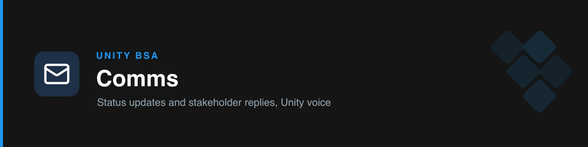

# unity-comms

Drafts the team's **status updates** and **stakeholder replies** in Unity's voice — professional, organized, clear, using day-to-day vocabulary without oversimplifying.

## Modes

- **Status update (ongoing process):** Where we are → Done / In progress / Blocked → Next milestone + date → What I need from you.
- **Stakeholder reply:** Acknowledge the ask → answer directly (or say what's needed to answer) → concrete next step + owner + timing.

## Voice rules

- Lead with the point; plain working vocabulary.
- No corporate filler, no over-formality, no vague hedging, no emojis in formal replies.

## How it works

Identifies audience and the single action you want from the reader, drafts to the mode structure, and self-reviews against the tone guide. Structures are starting points — it adapts to the specific message.

## Triggers

status update, stakeholder reply, draft a message, summarize, reword, write back to, project update, share status.

## References

- `references/tone-guide.md` — voice, structures, and the "avoid" list.
