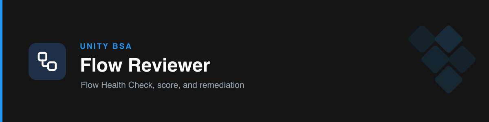

# unity-flow-reviewer

Unity's Salesforce **Flow expert**. Give it a Flow's XML, JSON, or a prose description and it returns a **Flow Health Check** — measured against the team's Flow Standards — with a deployment verdict and a step-by-step path to approval.

## How it works

- **Zero-Tolerance gate (run first):** any violation blocks deployment, regardless of score.
  1. No DML/SOQL inside loops
  2. Every DML has a fault connector (`{!$Flow.FaultMessage}`)
  3. No hardcoded 15/18-char IDs
- **Deployment Readiness Score /100:** DML-in-loops (30) · fault connectors (30) · no hardcoded IDs (20) · bulk-tested 200+ (10) · naming (5) · documentation (5).
- **Verdict:** `✅ DEPLOYMENT APPROVED` (100 and all rules pass) or `🛑 DEPLOYMENT BLOCKED`.

## Output — Flow Health Check

1. Summary + verdict
2. Zero-Tolerance results (per rule, offending element named)
3. Score table (points per line)
4. **How to get approved** — numbered remediation, each citing the rule
5. Next Step

## Triggers

flow, screen flow, record-triggered, autolaunched, subflow, bulkification, fault path, governor limits, DML in loop, flow XML, flow metadata, "review my flow".

## References

- `references/flow-standards.md` — the full Unity Flow Standards (naming, patterns, error handling, bulkification, config, docs, testing, code-review, the score).
