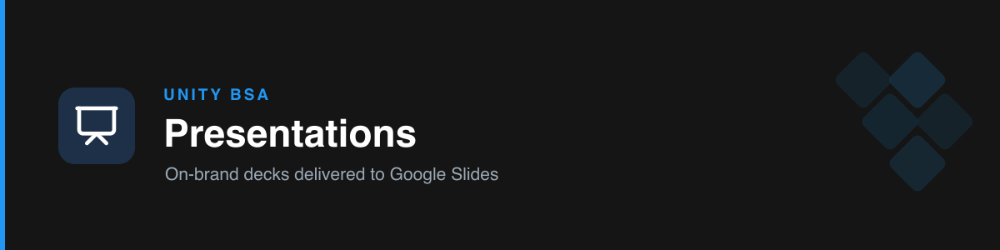

# unity-presentations

Builds Unity-branded **presentations** on the team's real deck templates and delivers a polished **PowerPoint that imports into Google Slides in one step**.

## Deck types

- **Project / meeting review** ("Enrichment" template): Goal → Business requirement → Solution & constraints → Who it serves → Issues → Demo → Support effort → What could be done differently → How measured.
- **General "AI-BSA" style**: title → agenda → section dividers → concise content → next steps.

## How it works

1. **Plan** — confirm deck type, topic, sections, audience; show the outline; get approval.
2. **Design base** — the real template leads the look; content adapts to the ask (it guides, it doesn't dictate end-to-end).
3. **Build** — via the `pptx` engine, with **real icons** (Lucide, rasterized) and product mockups, kept low-density in the Unity palette.
4. **Deliver** — hand over the `.pptx`; drag into Google Drive / File → Open in Slides → a fully editable native deck.

> Programmatic native Google Slides editing isn't available, and pushing the binary to Drive isn't reliable — so the skill delivers a `.pptx` that converts on import.

## Triggers

presentation, slides, deck, google slides, pptx, project review, meeting deck, present this, build a deck.

## References

- `references/deck-templates.md` — the two deck structures + Unity palette/density rules + template file IDs.
- `references/build-and-deliver.md` — the export → build → deliver pipeline and the visuals/icon approach.
