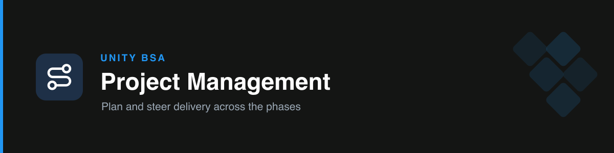

# unity-project-management

Plans and steers Unity Salesforce delivery through the team's **phased flow** — from the Salesforce-process owner's seat.

## The phases

Requirements → Scope → Design (+ Planning/ETA) → Development / Implementation → QA → QA with POC → Go Live. Each has an **exit gate** and points to the Unity skill that helps in that phase.

## Modes

- **Mode A — Plan a project:** produces a **bulleted phased plan**. It **clarifies unclear items first** (never guesses intent), keeps **Scope short and precise** (a one-line statement + high-level step notes), surfaces **missing requirements**, estimates effort and **commits an ETA**, keeps QA phases high-level, and **asks the go-live follow-ups** (backfill/datafix, comms, rollback, monitoring).
- **Mode B — Advise / status:** identifies the **current phase**, checks the **exit gate**, names what's blocking, and gives the next actions — routing to the relevant skill.

## How it works

- **Clarify before planning** — lists ambiguous items and asks before producing the plan.
- **Knows whose seat you're in** — you own Salesforce; other teams (AdOps, Legal, product) are integration points / POCs, not your scope.
- **Doesn't skip gates** — requirements before design, design before build.

## Boundary

Owns the **journey** (phases, sequence, ETA, gates). It does **not** write the TDD/design — at the Design phase it hands off to `unity-tech-design`.

## Triggers

project plan, delivery phases, scope, go-live, project management, SDLC phases, what phase, next steps, roadmap, milestones, datafix.

## References

- `references/delivery-phases.md` — phases, exit gates, planning/ETA, go-live follow-ups, and per-phase skill handoffs.
