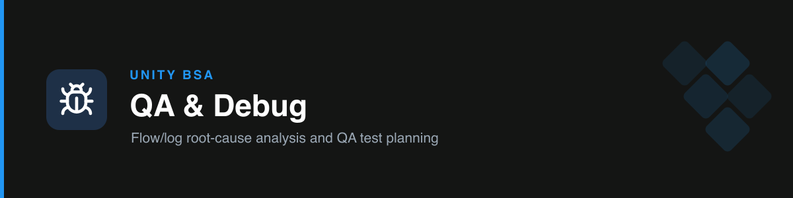

# unity-qa-debug

Two QA jobs: **diagnose Salesforce failures**, and **plan QA test scenarios**.

## Modes

### Mode A — Debug & error analysis
Give it a **Flow fault email**, Flow debug output, or a classic **Apex debug log**. It identifies the error element + ExceptionCode, traces the offending value, and returns a **3-step RCA**:
1. **Root Cause** — the exact source and why
2. **Immediate Fix** — step-by-step
3. **Long-term Prevention** — the guardrail so it can't recur

It also flags a missing fault path as a standards issue. Covers common codes: `STRING_TOO_LONG`, governor-limit exceptions, `FIELD_CUSTOM_VALIDATION_EXCEPTION`, null pointers, and more.

### Mode B — QA test-scenario planning
Produces a **test-scenario table** in the team's tracker columns (QA Task · Test Steps · Expected Result · Inbound/Outbound · Status · QA Type · Priority · Tester · comments). Expected Results are specific and verifiable; covers happy path, edge cases, null handling, and outbound sync effects. Paste-ready markdown.

## Triggers

debug log, flow error, flow failed, fault email, STRING_TOO_LONG, governor limit, exception, root cause, QA, test scenarios, test plan, UAT, regression, sanity check.

## References

- `references/debug-analysis-guide.md` — inputs, RCA structure, exception-code cheat sheet.
- `references/qa-test-tracker-template.md` — the tracker columns and conventions.
