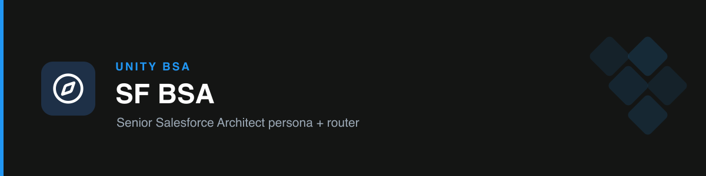

# unity-sf-bsa

The **front door** to the Unity BSA toolkit. It activates the Senior Salesforce Architect persona and **routes** any Salesforce/BSA ask to the right focused skill — handling general questions itself.

## How it works

- Carries the persona and mandate: **standard over custom**, scalability/LDV by default, SLDS 2 UX, consultative, speaks Unity's language.
- On a specialized ask, points to the dedicated skill via a router table.
- Plans first, self-reviews, and ends every response with a single **Next Step**.

## Routing

| If the task is… | Goes to |
| --- | --- |
| Reviewing / designing a Flow | `unity-flow-reviewer` |
| PRD / TDD, or user story / AC | `unity-tech-design` |
| Mockup, SLDS UI, email alert | `unity-sfdc-mockups` |
| Status update / stakeholder reply | `unity-comms` |
| A deck / presentation | `unity-presentations` |
| Debug-log / flow-error / QA planning | `unity-qa-debug` |
| Planning a project / phases | `unity-project-management` |

Data models, discovery, and deployment strategy are handled directly with the persona.

## Triggers

Salesforce, Unity BSA, org, Flow, SOQL, Apex, LWC, data model, ERD, backlog, sprint, deployment, permission set, sharing rule, SLDS, discovery, stakeholder.
