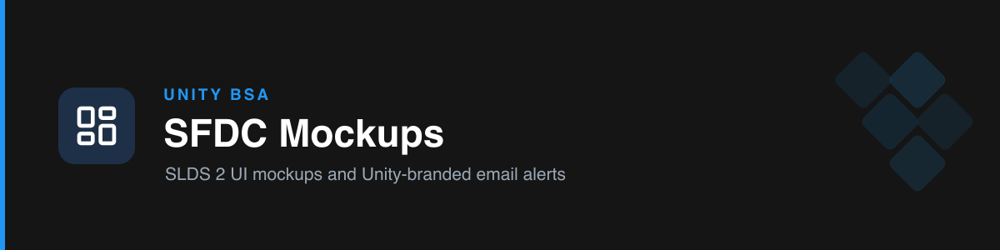

# unity-sfdc-mockups

Produces **SLDS 2.0 UI mockups** and **Unity-branded HTML email alerts** in the team's real Salesforce theme — clean, modern, and low-density.

## The Unity theme

| Role | Hex |
| --- | --- |
| Brand blue (primary actions) | `#2196F3` |
| Darker blue (hover / accent) | `#0F61A3` |
| Ink (text, nav, icons) | `#141514` |
| Button content on blue | `#FFFFFF` |

Blue is the only accent. Modern and rounded — matches Unity's real LWCs, not classic Salesforce admin UI.

## Modes

- **Mode A — Lightning / LWC / Screen Flow:** authentic SLDS 2 markup — real stylesheet, `slds-page-header`, cards, `slds-table`, brand buttons — themed to Unity, then rendered so you see the real look.
- **Mode B — HTML email alert:** fills a table-based, email-client-safe template (near-black header, blue accents). The info grid, badge, second button, and callout are **optional** — the skill builds the cleanest email for the message.

## How it works

Composes with the `frontend-design` engine for coded UI. Adapts structure to the use case; the palette, SLDS 2, and modern aesthetic are the non-negotiables.

## Triggers

mockup, wireframe, SLDS, Lightning page, screen flow UI, email alert, email notification, HTML template, UI design, layout.

## References

- `references/slds2-unity-tokens.md` — palette + modern aesthetic rules.
- `references/slds2-components.md` — real SLDS 2 component blueprints + Unity theming.
- `references/email-alert-template.html` — the email starting point.
