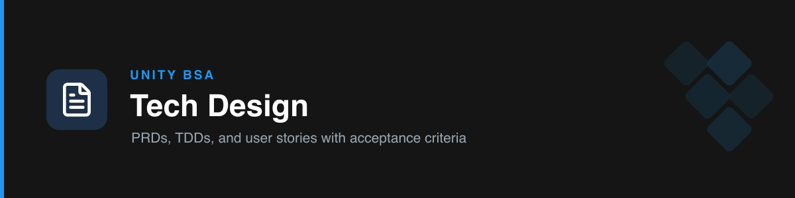

# unity-tech-design

Writes focused Unity **PRDs/TDDs** and **user stories with acceptance criteria**, translating business requirements into Salesforce best practices. Plans before writing and self-reviews before presenting.

## Modes

| Mode | For | Output |
| --- | --- | --- |
| **A — PRD / TDD** | A whole feature/solution | The combined Unity PRD/TDD (Motivation → ERD → Stakeholders → Flow → Detailed Design → Backfill → Go-live → Open Questions) |
| **B — User stories & AC** | A backlog item | `As a / I want / so that` + acceptance criteria (Given/When/Then or checklist) + MoSCoW + Sprint-Ready verdict |

## How it works

- **Mode A** runs a mandatory **plan-before-write gate** — it shows the outline + assumptions and asks for missing inputs before drafting. Keeps docs focused (2–4 pages), covers all error-handling status codes, and every Open Question gets an owner.
- **Mode B** enforces the AC quality bar (specific role, testable AC, no ambiguous words, edge/null/error coverage), runs an INVEST + Definition-of-Ready check, and marks stories **✅ Sprint-Ready** or **🔴 Not Sprint-Ready**.
- Before presenting a document, it runs the **Golden-Rule self-review** (best practices? scalable? security? understandable? duplicated?).

## Boundary

Owns the **deliverable** (design + stories). It does **not** plan phases/ETA/sequencing — that hands off to `unity-project-management`.

## Triggers

PRD, TDD, technical design, document this feature, ERD, detailed design, user story, acceptance criteria, AC, sprint-ready, definition of ready.

## References

- `references/prd-tdd-template.md` — the combined Unity PRD/TDD template.
- `references/user-story-standard.md` — story format, AC quality bar, INVEST, Definition of Ready.
