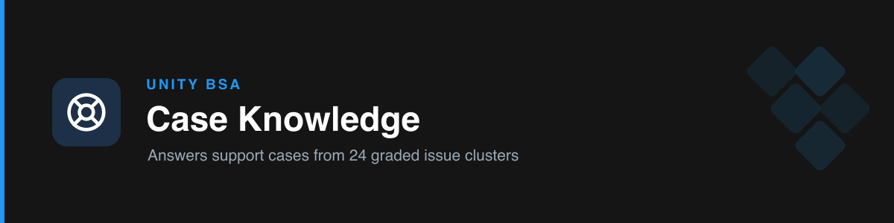

# handbook-cases

**Answers Business Systems support cases** from a knowledge base built out of real closed cases. Paste a case, a case number or a ticket subject; get a short diagnosis and the exact steps for the teammate who will resolve it, with a percentage confidence.

## How it works

- **24 issue clusters, built from the queue.** 426 closed `Saleforce` cases from 90 days were clustered by common issue. Each cluster file holds the definition, detection signals, how the team resolves it, what to ask the requester, a canonical answer, common mistakes and when to escalate.
- **Graded by the owner.** Four grading rounds (September to October 2026) corrected the answers; 15 clusters are approved, the rest are kept and answer with a capped confidence.
- **Two-section answer.** `Summary` (what is wrong and the mechanism) and `Suggested resolution` (3 to 8 numbered steps in Salesforce terms), under 250 words, then `Confidence: nn%` and the cluster slug.
- **Strictly read-only.** It never creates, updates or deletes a Salesforce record and never contacts the requester. The teammate does the work in Salesforce.
- **Optional live context.** With a read-only Grow PROD connector it can read the case, its emails, the account's finance fields and recent error logs, after an org identity gate. Without one it answers from the knowledge base and says so.

## Coverage

New Salesforce user · Bills not syncing to Workday · Credit lines and prepay · Approver and approval-matrix assignment · Reports and list views · Handover failures · Permissions and access changes · Bulk data fixes · Opportunity and lead changes · Account merge, parent change, payment terms · Org / dashboard account linking · Notifications, alerts, quick texts · Invoice generation and billing setup · Case management config · Commission hierarchy · Campaign uploads · New Ironclad user · Dispute changes · RWR / real-money sync · Okta deactivation · AM sync and creative limit · Revenue adjustments upload · Ironclad IO generation · Invoice AM re-tag

Index: [`knowledge/cases/taxonomy.md`](./knowledge/cases/taxonomy.md).

## Examples

- "New case: please give my new hire the same Salesforce access as Dana."
- "Approve RMG and connect these 30 orgs to our credit line."
- "Bill didn't sync to Workday, what do I check?"
- "Case 01234567 - what should I do with it?"
- "מה עושים עם הטיקט הזה?" (answered in English)

## Relationship to the other handbook skills

| Need | Skill |
| --- | --- |
| What to do with a support case | `handbook-cases` |
| How a documented process works, full approver tables, owners | [`handbook-processes`](../handbook-processes) |
| Batch timing, Apex logic, why an automation did not fire | [`handbook-code-lookup`](../handbook-code-lookup) |
| The current org value of a documented setting | [`handbook-refresh`](../handbook-refresh) |

## Boundary

Answers only. It does not mirror cases, write suggestions to a sandbox, run on a schedule, grade suggestions or edit its own knowledge; that is the Case Resolver pipeline, whose updates reach this folder through a reviewed PR. Outbound replies to the requester belong to `unity-comms`.

## Files

- `knowledge/cases/` - one file per cluster, plus `taxonomy.md` (index) and `README.md` (file contract).
- `knowledge/feedback/` - the owner's grading rounds, kept as a history of corrections.
- `references/answer-standard.md` - the two-section format and the confidence calibration.
- `references/qa-recipes.md` - read-only research recipes and query rules.

## Keeping it current

The knowledge is a copy of the Case Resolver's `knowledge/` folder (snapshot 2026-10-04: 24 clusters, 15 approved). When the pipeline folds a new grading round, copy the updated files here in a PR. Never put case text, names or case numbers into these files.
